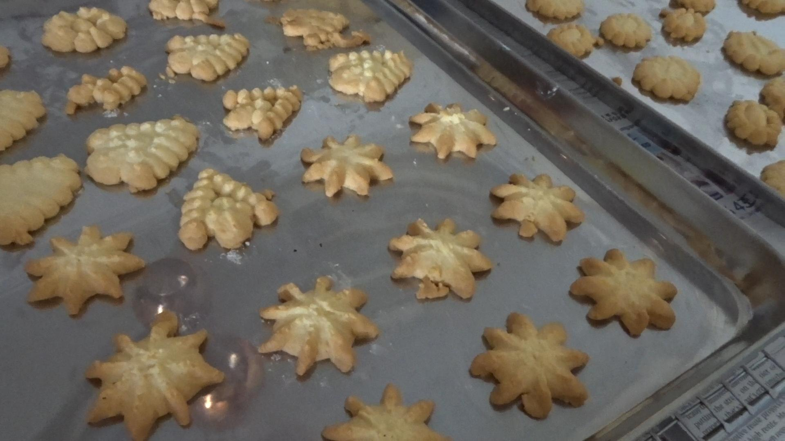

[Back to homepage](https://ah-jia.github.io/)

# Semolina Biscuit

## Ingredients
- 250g butter
- 140g castor sugar
- 1 egg
- 340 g flour
- 110 g semolina flour
- 1 tsp vanilla essence/almond essence

## Steps
1. Beat butter, sugar and egg till light.
2. Add in the vanilla/almond essence.
3. Sieve the flour and semolina flour together, add into the butter to form a dough.
4. Fill into cookie cutter and press out shapes.
5. Baked at 175 degC for 10-15 min.

[Back to homepage](https://ah-jia.github.io/)
